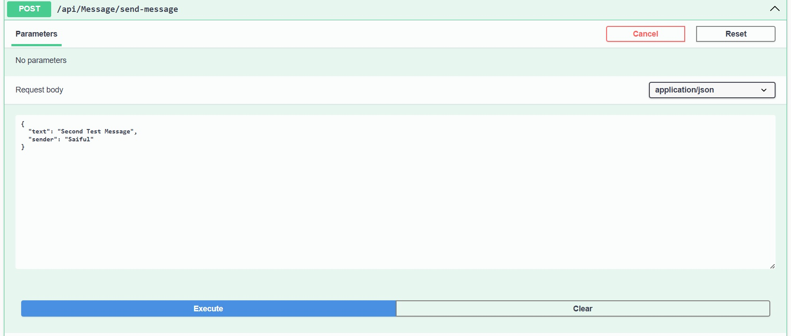
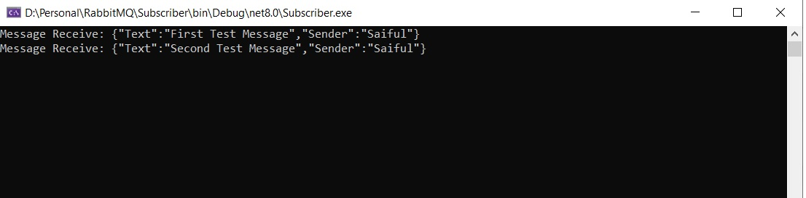
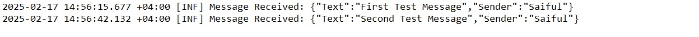

# RabbitMQ Message Queue Sample

## Overview
This is a **RabbitMQ** sample project demonstrating how to send messages to an exchange (multi_log_msg) and consume them using multiple consumers:

1. **A console application (queue_console)**

2. **A web API with a background service (queue_webapi)**

This setup ensures efficient message processing with multiple subscribers.

## Features
**RabbitMQ Message Broker for Asynchronous Messaging**

**Fanout Exchange to simultaneously deliver messages to multiple queues**

**Multiple Consumers to handle messages concurrently**

**Automatic Queue Binding for message distribution**

## Tech Stack
**.NET 8**

**RabbitMQ**

**ASP.NET Web API (Background Service)**

**Console Application**

## Send message from web api producer

## Consume message by console app

## Consume message by web api background service

